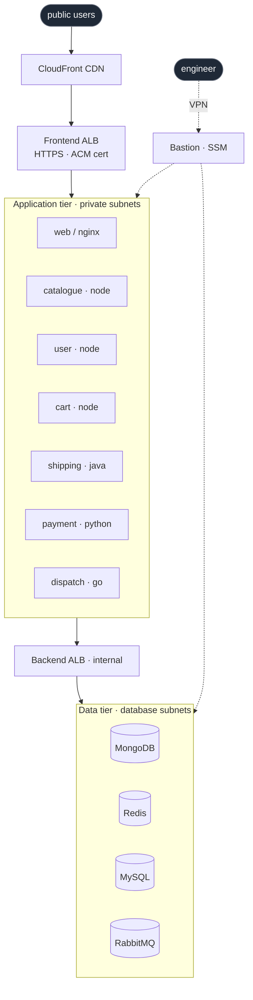

<h1 align="center">Hi, I'm Sashank</h1>
<h3 align="center">DevOps / Platform Engineer &nbsp;·&nbsp; AWS &amp; Azure &nbsp;·&nbsp; Kubernetes &nbsp;·&nbsp; Terraform &nbsp;·&nbsp; ex-IBM</h3>

  
  

### About me

DevOps / Platform Engineer with 4 years of experience building and operating cloud-native infrastructure at Greenhouse Software and IBM. I focus on CI/CD pipelines, Kubernetes operations, Terraform-driven infra, and observability for customer-facing platforms on AWS and Azure.

Based in New York City. Open to DevOps, SRE, Platform Engineering, Infrastructure Engineering, and Cloud Engineering roles (onsite, hybrid, or fully remote in the US).

### Production impact

**Greenhouse Software** &nbsp; DevOps Engineer &nbsp; Aug 2024 to Present

- Cut end-to-end deployment time 65% (6h → 2h) across 20+ production services by building Jenkins Shared Libraries and GitHub Actions pipelines, integrated with SonarQube and Nexus.
- Led containerization of 20+ microservices to Amazon EKS with Helm and HPA. Zero-downtime rolling updates, 30% fewer post-deploy incidents.
- Dropped MTTD 50% with Prometheus, Grafana, and New Relic. Shrank RTO from 2 hours to 30 minutes via automated DR workflows and resilience testing.
- Reduced AWS data-transfer costs and attack surface through PrivateLink, VPC endpoints, IAM RBAC, and WAF/Shield. Reusable Terraform modules cut environment setup from days to hours.

**IBM** &nbsp; DevOps Engineer &amp; SRE &nbsp; May 2021 to Jul 2023

- Eliminated 100% of manual configuration drift across 15+ production apps using Terraform, CloudFormation, and Ansible Tower.
- Cut root-cause analysis time 50% by standing up a centralized ELK stack for real-time observability.
- Reduced production hotfixes 40% and API response times from 900ms → 350ms by standardizing GitFlow, adding peer-review gates, and running load tests with JMeter and Postman.
- Cut MTTD from 15 minutes to under 5 with Python and Bash monitoring scripts integrated with AWS CloudWatch. Maintained 99% uptime during peak traffic.
- Drove a 70% decrease in incident recurrence within 3 months by resolving 6 recurring root-cause bottlenecks and authoring blameless postmortems and runbooks.

### Tech stack

**Cloud &amp; Infrastructure**

**Containers &amp; Orchestration**

**CI/CD &amp; GitOps**

**Monitoring &amp; Logging**

**Languages &amp; Scripting**

### Portfolio projects: RoboShop platform

A portable reference for the same deployment patterns I ship at work. An 11-service e-commerce platform (Node.js, Java, Python, Go, MongoDB, Redis, MySQL, RabbitMQ, Nginx) built up in layers, from bash on one box to a phased Terraform + Ansible platform on AWS.

**Flagship: layered IaC deployment**

| Repo | What it demonstrates |
|---|---|
| [`roboshop-infra-dev`](https://github.com/sashank1064/roboshop-infra-dev) | Full platform in 13 phased Terraform stacks (`00-vpc` to `91-cdn`), isolated state per phase, published modules pinned by ref |
| [`terraform-aws-roboshop`](https://github.com/sashank1064/terraform-aws-roboshop) | Per-component infra (target group, instance, listener rule, DNS) with `ansible-pull` bootstrap in user_data |
| [`ansible-roboshop-roles-tf`](https://github.com/sashank1064/ansible-roboshop-roles-tf) | Configuration layer applied by `ansible-pull` on first boot, no control node |

**Published reusable modules**

| Repo | What it demonstrates |
|---|---|
| [`terraform-aws-vpc`](https://github.com/sashank1064/terraform-aws-vpc) | Three-tier VPC module, multi-AZ, optional peering, consumed via `git::` source |
| [`terraform-aws-securitygroup`](https://github.com/sashank1064/terraform-aws-securitygroup) | SG factory with consistent naming and tag-driven discovery |
| [`terraform-aws-instance`](https://github.com/sashank1064/terraform-aws-instance) | EC2 module with instance-type validation and required tags |

**Progression repos (how the patterns evolved)**

| Repo | What it demonstrates |
|---|---|
| [`shell-roboshop`](https://github.com/sashank1064/shell-roboshop) | Bash provisioning, systemd, Nginx reverse proxy, the baseline before IaC |
| [`ansible-roboshop`](https://github.com/sashank1064/ansible-roboshop) | Flat Ansible playbooks, idempotent, per-service |
| [`ansible-roboshop-roles`](https://github.com/sashank1064/ansible-roboshop-roles) | Refactored to reusable roles with defaults, handlers, Jinja templates |
| [`terraform`](https://github.com/sashank1064/terraform) | Terraform patterns workspace, one concept per folder |
| [`terraform-multi-env`](https://github.com/sashank1064/terraform-multi-env) | `tfvars`-per-env vs Terraform workspaces, compared side by side |

### Flagship architecture

What [`roboshop-infra-dev`](https://github.com/sashank1064/roboshop-infra-dev) actually deploys on AWS. Three tiers in isolated subnets, 7 application services on EC2, 4 managed data stores, engineer access behind a VPN and SSM bastion. Provisioned in 13 phased Terraform stacks, bootstrapped by `ansible-pull` on first boot.

Observability via CloudWatch, Prometheus, and Grafana. Tag-driven inventory (`Component`, `Environment`, `Project`) so Ansible discovers hosts the same way cost reports do. Phase-isolated Terraform state in S3 with DynamoDB locking. Modules pulled from [`terraform-aws-vpc`](https://github.com/sashank1064/terraform-aws-vpc), [`terraform-aws-securitygroup`](https://github.com/sashank1064/terraform-aws-securitygroup), [`terraform-aws-instance`](https://github.com/sashank1064/terraform-aws-instance), and [`terraform-aws-roboshop`](https://github.com/sashank1064/terraform-aws-roboshop).

### Education &amp; certifications

- M.S., Computer Science, Pace University, New York (2025)
- B.E., Computer Science &amp; Engineering, BMS Institute of Technology and Management (2022)
- InfraExpert, AlgoExpert.io
- AI Fluent Tech Professional
- Initiating and Planning Projects

  <i>Open to DevOps, SRE, Platform, Infrastructure, and Cloud Engineering roles. Onsite, hybrid, or remote. Based in NYC.</i> 
  <a href="mailto:sashankallugunti@gmail.com">sashankallugunti@gmail.com</a> &nbsp;·&nbsp;
  <a href="https://www.linkedin.com/in/sashank-allugunti/">LinkedIn</a>

